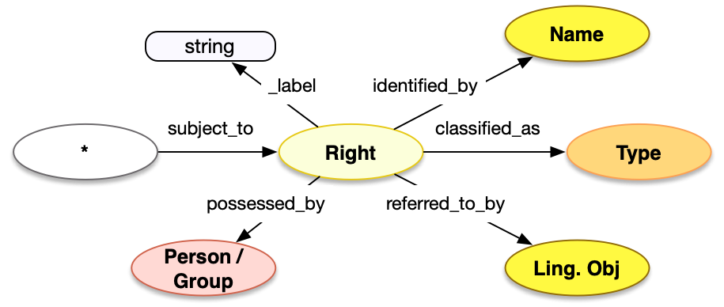

[TOC]

## Introduction

The Rights construct is used to express machine comparable, but not necessarily actionable, rights assertions about intellectual works. The URI for the class of Right is conveyed in `classified_as`.

See the model documentation for [rights](/model/object/rights/#rights-assertions).

## Property Definitions

The rights data structure has the following properties.

### Properties of Rights

| Property Name     | Datatype      | Requirement | Description | 
|-------------------|---------------|-------------|-------------|
| `id`              | string        | Optional    | If present, the value MUST be a URI identifying the right description, from which a representation of it can be retrieved | 
| `type`            | string        | Required    | The class for the right, which MUST be the value `"Right"` |
| `_label`          | string        | Recommended | A human readable label, intended for developers |
| `_complete`       | boolean       | Optional    | Non-Semantic. If there is an `id` property with a URI, and there is more information about the identifier available from the representation at that URI, then `_complete` MUST be present with a value of `false` to inform the consuming application that it might want to retrieve it |
| `identified_by`   | array         | Recommended | An array of json objects, each of which is a name for the right, and MUST follow the requirements for [Name](../name/) |
| `classified_as`   | array         | Recommended | An array of json objects, each of which is a further classification of the right and MUST follow the requirements for [Type](../type/) |
| `referred_to_by`  | array         | Optional    | An array of json objects, each of which is an embedded [statement](../statement/) about the right |
| `possessed_by`    | array         | Optional    | An array of json objects, each of which is a reference to a [Person](../../endpoint/person) or [Group](../../endpoint/group) that holds the right |

### Property Diagram

> {:.diagram_img width="600px"}

### Incoming Properties

Right instances are typically found as the object of the following properties.

| Property Name   | Source Endpoint   | Description |
|-----------------|-------------------|-------------|
| `subject_to`     | [Textual Work](../../endpoint/textual_work/), [Visual Work](../../endpoint/visual_work), [Abstract Work](../../endpoint/abstract_work), [Statement](../statement/) | Intellectual things, primarily works, can have rights associated with them using the `subject_to` property |

## Example

A textual work is in the public domain.

* The Textual Work is `subject_to` the Right
* The Right itself does not have a URI, but has a `type` of `Right`
* It is `classified_as` the sort of Right, in this case the Creative Commons URI for CC Zero
* It is `identified_by` a `Name`, which is `classified_as` being a Display Title, and the `content` of "Public Domain"

```crom
top = model.LinguisticObject(ident="auto int-per-segment", label="Example Text")
r = model.Right(label="Public Domain status of Example Text")
r.identified_by = vocab.DisplayName(content="Public Domain")
r.classified_as = model.Type(ident="https://creativecommons.org/publicdomain/zero/1.0/", label="cc0")
top.subject_to = r
```
