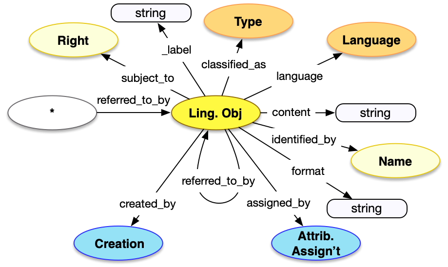

<style>
th, td {
  padding: 5px 5px;
  text-align: left;
  border: 1px solid #D0D0D0; }
th { background: #F0F0F0; }
th:first-child, td:first-child { padding-left: 3px; }
th:last-child, td:last-child { padding-right: 3px; }
</style>

[TOC]

## Introduction

Statements are a human-readable expression of the content or note about the entity being referred to. Even if there are structured forms of the resources, these textual descriptions are useful to render to end users. They can have both internationalized `content`, as well as internationalized labels in the form of `Name` instances associated with them.  These statements are embedded within the resource being described, rather than separate long form texts.

Statements are described in the [base patterns](/model/base/) of the model documentation, and examples are present for practically every class.

## Property Definitions

### Properties of Names

| Property Name     | Datatype      | Requirement | Description | 
|-------------------|---------------|-------------|-------------| 
| `id`              | string        | Optional    | If present, the value MUST be a URI identifying the statement, from which a representation of the statement can be retrieved | 
| `type`            | string        | Required    | The class for the statement, which MUST be the value `"LinguisticObject"` |
| `_label`          | string        | Optional    | A human readable label, intended for developers |
| `_complete`       | boolean       | Optional    | Non-Semantic. If there is an `id` property with a URI, and there is more information about the statement available from the representation at that URI, then `_complete` MUST be present with a value of `false` to inform the consuming application that it might want to retrieve it |
| `content`         | string        | Required    | The string value of the statement |
| `classified_as`   | array         | Recommended | An array of json objects, each of which is a further classification of the statement and MUST follow the requirements for [Type](../type/) |
| `language`        | array         | Recommended | An array of json objects, each of which is a language present in the content of the statement and MUST follow the requirements for [Language](../type/)|
| `identified_by`   | array         | Recommended | An array of json objects, each of which is a label or name for the statement, and MUST follow the requirements for [Name](../name/) |
| `referred_to_by`  | array         | Optional    | An array of json objects, each of which is either a reference to a [textual work](../../endpoint/textual_work/) that refers to this statement, or an embedded statement about this statement | 
| `format`          | string        | Optional    | If the string in content is not plain text, then format can be used to specify the media type of the string |
| `assigned_by`     | array         | Optional    | An array of json objects, each of which is an assignment of the statement, and MUST follow the requirements for [Assignments](../assignment/) |
| `subject_to` | array | Optional | An array of json objects, each of which is a [Right](../right) that is held over the statement |


### Property Diagram

> {:.diagram_img width="600px"}

### Incoming Properties

Statements are typically found as the object of the following properties.  This list is not exhaustive, but is intended to cover the most likely cases.

| Property Name    | Source Endpoint  | Description |
|------------------|------------------|-------------|
| `referred_to_by` | All              | Statements are almost always found in the `referred_to_by` property, and can be present in any of the API endpoints |


## Example

An object is `referred_to_by` a Description in English.

* The description has a `type` of "LinguisticObject"
* It is `classified_as` a description, with an `id` of _aat:300435416_ and `type` of "Type".  The description concept is in turn `classified_as` a type of "brief text"
* It has `content` of "A small greenstone pendant..."
* It is `identified_by` a display label, which has a `type` of "Name", and `content` of "Description"
* It has a `language` of English, which has an `id` of _aat:300388277_
* It has a statement about the description, saying that it was provided by the artist.

```crom
top = model.HumanMadeObject(ident="auto int-per-segment")
d = vocab.Description(content="A small greenstone pendant surrounded by silver")
d.language = vocab.instances['english']
d.identified_by = vocab.DisplayName(content="Description")
d.referred_to_by = model.LinguisticObject(content="Description provided by the artist")
top.referred_to_by = d
```
