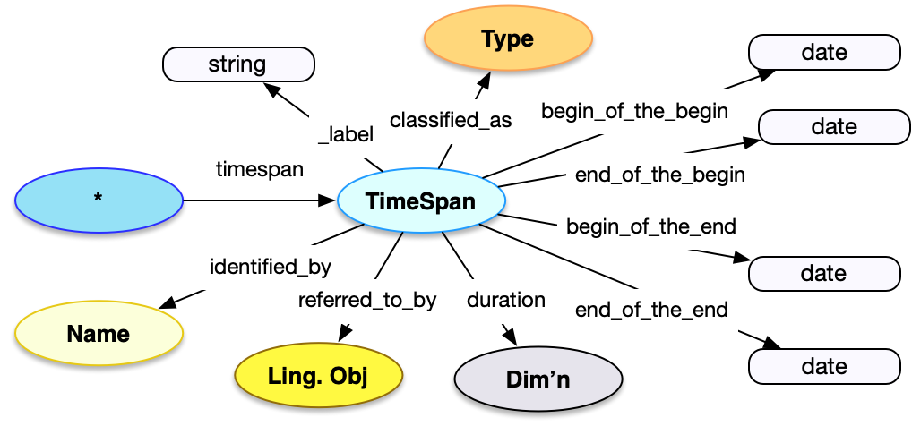

<style>
th, td {
  padding: 5px 5px;
  text-align: left;
  border: 1px solid #D0D0D0; }
th { background: #F0F0F0; }
th:first-child, td:first-child { padding-left: 3px; }
th:last-child, td:last-child { padding-right: 3px; }
</style>

[TOC]

## Introduction

The details of time spans are recorded using a data structure called a `TimeSpan`. Each period, event, activity or further more specific class can have its own time span with fuzzy starting and ending points, and a duration of time that the event lasted between the start and end.  They are always approximations, but allow for searching computation.

Timespans are used for all temporal entities, and described in the [base patterns](/model/base/#time-span-details) of the model.

## Property Definitions

The time span data structure has the following properties.

### Properties of TimeSpans

| Property Name     | Datatype      | Requirement | Description | 
|-------------------|---------------|-------------|-------------|
| `type`            | string        | Required    | The class for the name, which MUST be the value `"TimeSpan"` |
| `_label`          | string        | Recommended | A human readable label, intended for developers |
| `classified_as`   | array         | Recommended | An array of json objects, each of which is a further classification of the time span and MUST follow the requirements for [Type](../type/) |
| `identified_by`   | array         | Recommended | An array of json objects, each of which is a textual representation of the structured data in the time span, and MUST follow the requirements for [Name](../name/) |
| `begin_of_the_begin` | date       | Recommended | A string containing an ISO8601 formatted date-time, representing the earliest possible date at which the timespan could have started |
| `end_of_the_end`  | date          | Recommended | A string containing an ISO8601 formatted date-time, representing the latest possible date at which the timespan could have ended |
| `end_of_the_begin` | date         | Optional    | A string containing an ISO8601 formatted date-time, representing the latest possible date at which the timespan could have started |
| `begin_of_the_end` | date         | Optional    | A string containing an ISO8601 formatted date-time, representing the earliest possible date at which the timespan could have ended |
| `referred_to_by`  | array         | Optional    | An array of json objects, each of which is either a [reference](../reference/) to a [textual work](../../endpoint/textual_work/) that refers to the time span, or an embedded [statement](../statement/) about the time span. |
| `duration`        | json object   | Optional    | A json object representing the length of time for the time span within the date range, which MUST follow the requirements for [Dimensions](../dimension/) | 

### Property Diagram

> {:.diagram_img width="600px"}

### Incoming Properties

Dimension instances are typically found as the object of the following properties.  This list is not exhaustive, but is intended to cover the likely cases.

| Property Name   | Source Endpoint   | Description |
|-----------------|-------------------|-------------|
| `timespan`      | All endpoints     | The timespan is the range of time for an activity in any endpoint |


## Example

An activity has a time span with a duration of 1 day, sometime circa 1750

* It has a `type` of "TimeSpan"
* It has a `_label` which briefly describes it as "1 day, c. 1750"
* It is `identified_by` a Name, with `content` of "1 day, during circa 1750"
* It is `referred_to_by` a description statement, with the `content` of "About 1750, as estimated by C. U. Rata"
* It has a `begin_of_the_begin` earliest start date of 1720
* It has a `end_of_the_begin` latest start date of 1751
* It has a `begin_of_the_end` earliest end date of 1749
* It has a `end_of_the_end` latest end date of 1780
* It took a `duration` of time which ...
    * ... has a `type` of "Dimension"
    * ... has a `value` of 1
    * ... has a `unit` of days, which has an `id` of _aat:300379242_ and has a `type` of "MeasurementUnit"

```crom
top = model.Activity(ident="auto int-per-segment")
ts = model.TimeSpan(label="1 day, c. 1750")
ts.identified_by = model.Name(content="1 day, during circa 1750")
ts.referred_to_by = vocab.Description(content="About 1750, as estimated by C. U. Rata")
ts.begin_of_the_begin = "1720-01-01T00:00:00Z"
ts.end_of_the_begin = "1751-01-01T00:00:00Z"
ts.begin_of_the_end = "1749-01-01T00:00:00Z"
ts.end_of_the_end = "1780-01-01T00:00:00Z"
dur = model.Dimension()
dur.value = 1
dur.unit = vocab.instances['days']
ts.duration = dur
top.timespan = ts
```
